# 熙心健康体检平台 - 核心表ER图

## 1. 用户体系

### user 用户表
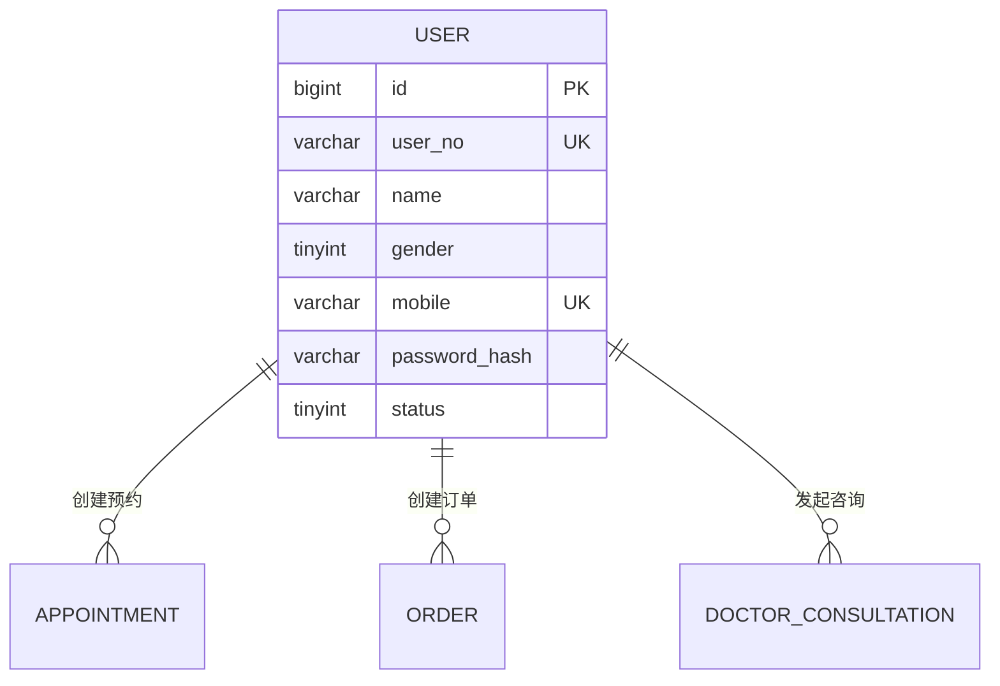
```mermaid
erDiagram
    USER {
        bigint id PK
        varchar user_no UK
        varchar name
        tinyint gender
        varchar mobile UK
        varchar password_hash
        tinyint status
    }

    USER ||--o{ APPOINTMENT : "创建预约"
    USER ||--o{ ORDER : "创建订单"
    USER ||--o{ DOCTOR_CONSULTATION : "发起咨询"
```

### staff_account 后台账号表
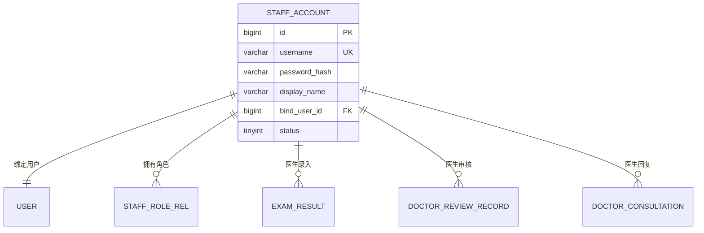
```mermaid
erDiagram
    STAFF_ACCOUNT {
        bigint id PK
        varchar username UK
        varchar password_hash
        varchar display_name
        bigint bind_user_id FK
        tinyint status
    }

    STAFF_ACCOUNT ||--|| USER : "绑定用户"
    STAFF_ACCOUNT ||--o{ STAFF_ROLE_REL : "拥有角色"
    STAFF_ACCOUNT ||--o{ EXAM_RESULT : "医生录入"
    STAFF_ACCOUNT ||--o{ DOCTOR_REVIEW_RECORD : "医生审核"
    STAFF_ACCOUNT ||--o{ DOCTOR_CONSULTATION : "医生回复"
```

### staff_role_rel 角色关联表
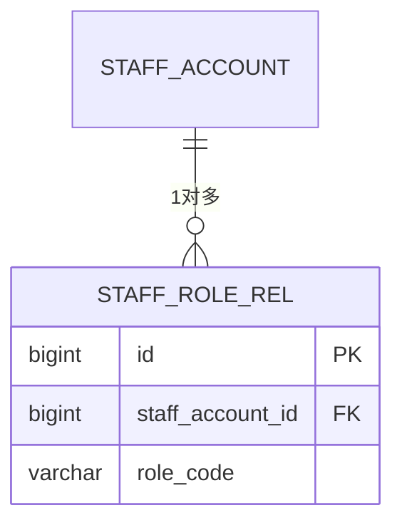
```mermaid
erDiagram
    STAFF_ROLE_REL {
        bigint id PK
        bigint staff_account_id FK
        varchar role_code
    }

    STAFF_ACCOUNT ||--o{ STAFF_ROLE_REL : "1对多"
```

---

## 2. 预约与套餐

### exam_package 体检套餐表
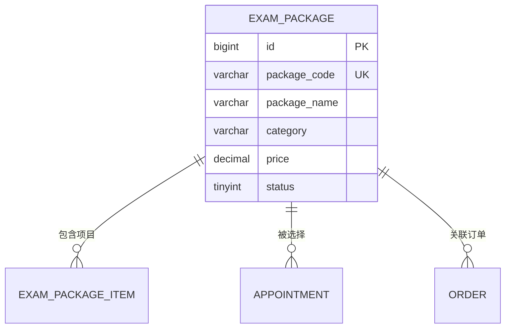
```mermaid
erDiagram
    EXAM_PACKAGE {
        bigint id PK
        varchar package_code UK
        varchar package_name
        varchar category
        decimal price
        tinyint status
    }

    EXAM_PACKAGE ||--o{ EXAM_PACKAGE_ITEM : "包含项目"
    EXAM_PACKAGE ||--o{ APPOINTMENT : "被选择"
    EXAM_PACKAGE ||--o{ ORDER : "关联订单"
```

### appointment 预约表
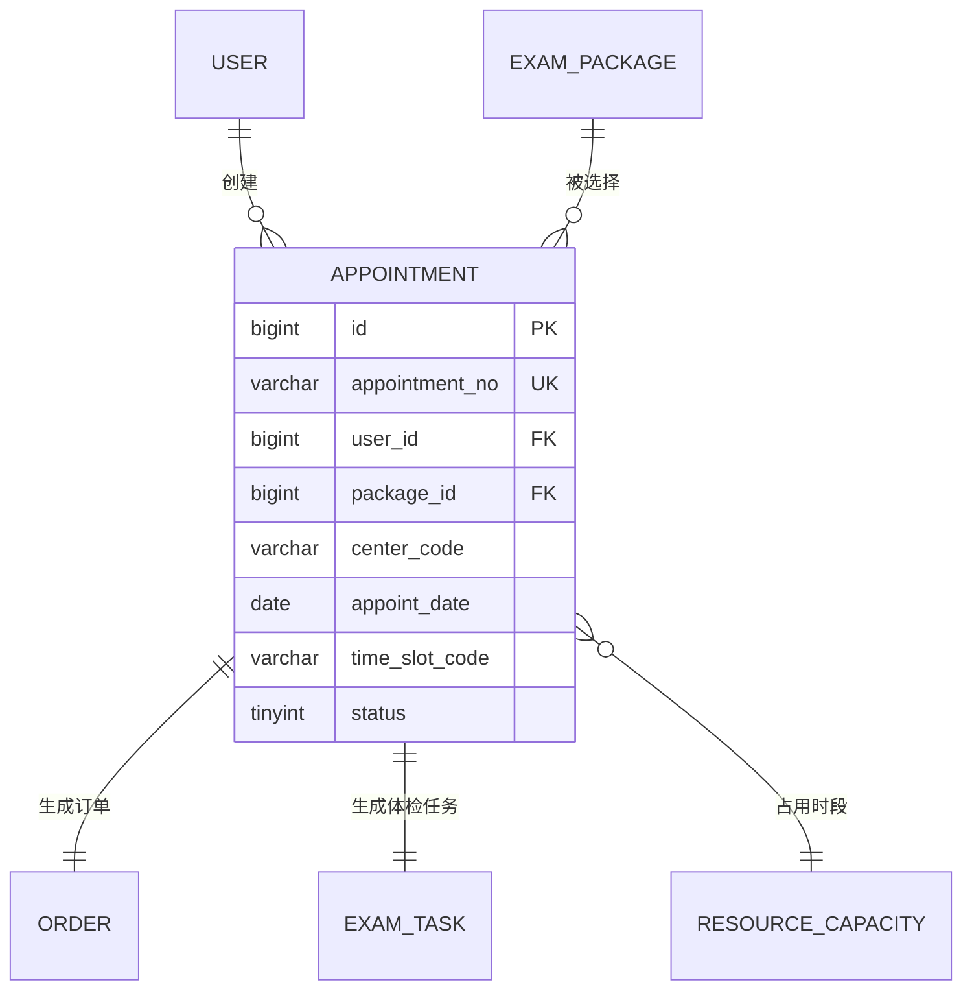
```mermaid
erDiagram
    APPOINTMENT {
        bigint id PK
        varchar appointment_no UK
        bigint user_id FK
        bigint package_id FK
        varchar center_code
        date appoint_date
        varchar time_slot_code
        tinyint status
    }

    USER ||--o{ APPOINTMENT : "创建"
    EXAM_PACKAGE ||--o{ APPOINTMENT : "被选择"
    APPOINTMENT ||--|| ORDER : "生成订单"
    APPOINTMENT ||--|| EXAM_TASK : "生成体检任务"
    APPOINTMENT }o--|| RESOURCE_CAPACITY : "占用时段"
```

### resource_capacity 资源容量表
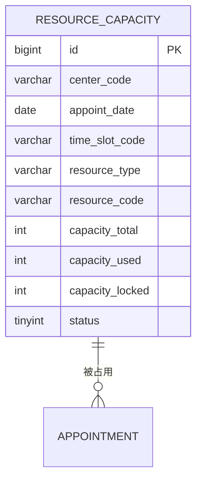
```mermaid
erDiagram
    RESOURCE_CAPACITY {
        bigint id PK
        varchar center_code
        date appoint_date
        varchar time_slot_code
        varchar resource_type
        varchar resource_code
        int capacity_total
        int capacity_used
        int capacity_locked
        tinyint status
    }

    RESOURCE_CAPACITY ||--o{ APPOINTMENT : "被占用"
```

---

## 3. 订单与支付

### order 订单表
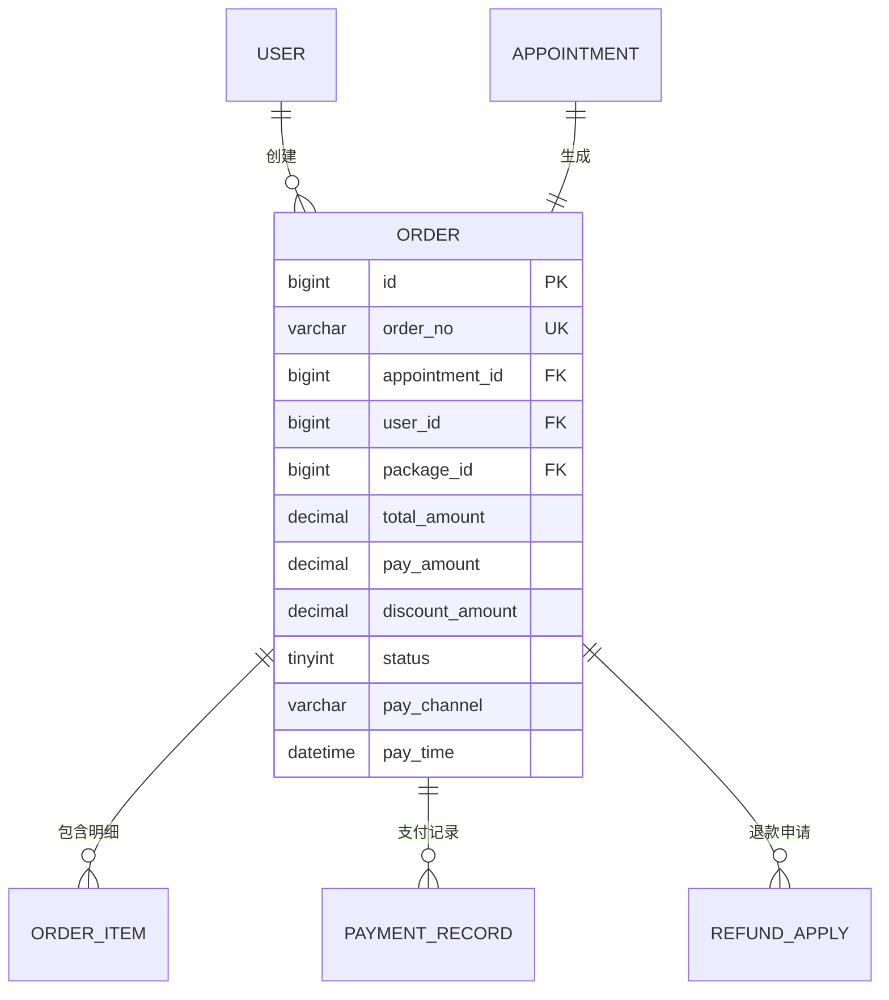
```mermaid
erDiagram
    ORDER {
        bigint id PK
        varchar order_no UK
        bigint appointment_id FK
        bigint user_id FK
        bigint package_id FK
        decimal total_amount
        decimal pay_amount
        decimal discount_amount
        tinyint status
        varchar pay_channel
        datetime pay_time
    }

    USER ||--o{ ORDER : "创建"
    APPOINTMENT ||--|| ORDER : "生成"
    ORDER ||--o{ ORDER_ITEM : "包含明细"
    ORDER ||--o{ PAYMENT_RECORD : "支付记录"
    ORDER ||--o{ REFUND_APPLY : "退款申请"
```

### order_item 订单明细表
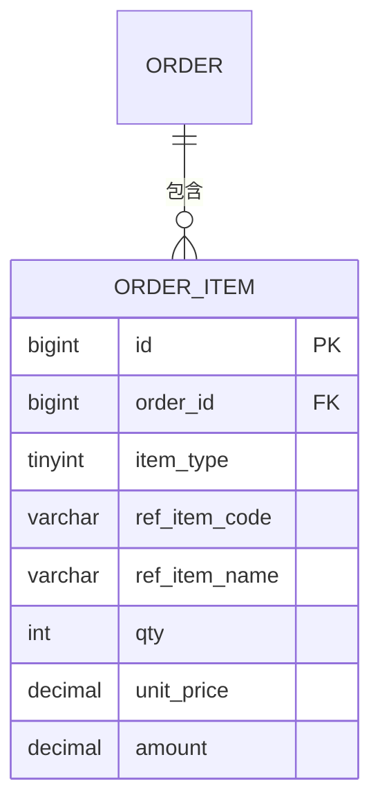
```mermaid
erDiagram
    ORDER_ITEM {
        bigint id PK
        bigint order_id FK
        tinyint item_type
        varchar ref_item_code
        varchar ref_item_name
        int qty
        decimal unit_price
        decimal amount
    }

    ORDER ||--o{ ORDER_ITEM : "包含"
```

### payment_record 支付流水表
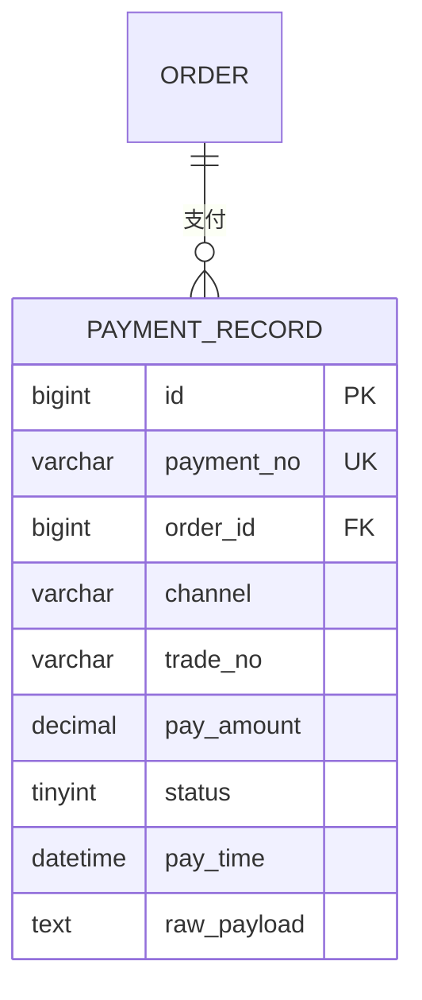
```mermaid
erDiagram
    PAYMENT_RECORD {
        bigint id PK
        varchar payment_no UK
        bigint order_id FK
        varchar channel
        varchar trade_no
        decimal pay_amount
        tinyint status
        datetime pay_time
        text raw_payload
    }

    ORDER ||--o{ PAYMENT_RECORD : "支付"
```

---

## 4. 体检执行

### exam_task 体检任务表
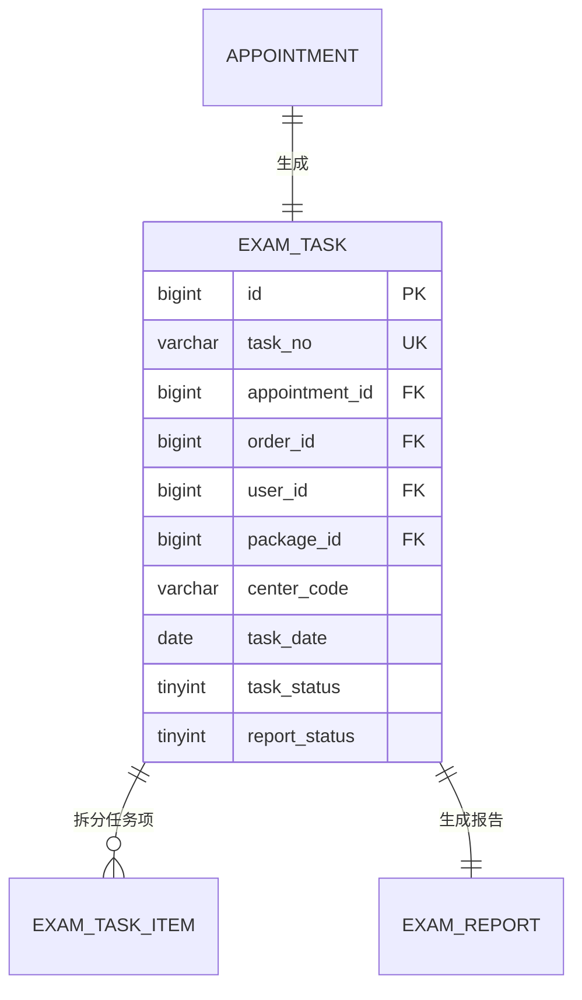
```mermaid
erDiagram
    EXAM_TASK {
        bigint id PK
        varchar task_no UK
        bigint appointment_id FK
        bigint order_id FK
        bigint user_id FK
        bigint package_id FK
        varchar center_code
        date task_date
        tinyint task_status
        tinyint report_status
    }

    APPOINTMENT ||--|| EXAM_TASK : "生成"
    EXAM_TASK ||--o{ EXAM_TASK_ITEM : "拆分任务项"
    EXAM_TASK ||--|| EXAM_REPORT : "生成报告"
```

### exam_task_item 体检任务项表
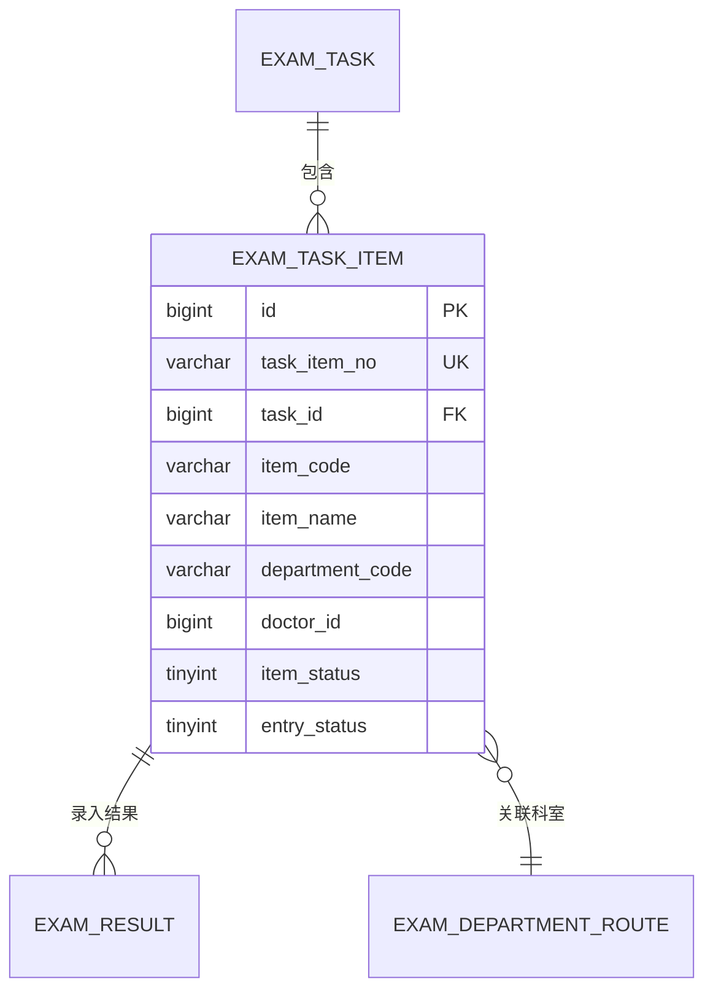
```mermaid
erDiagram
    EXAM_TASK_ITEM {
        bigint id PK
        varchar task_item_no UK
        bigint task_id FK
        varchar item_code
        varchar item_name
        varchar department_code
        bigint doctor_id
        tinyint item_status
        tinyint entry_status
    }

    EXAM_TASK ||--o{ EXAM_TASK_ITEM : "包含"
    EXAM_TASK_ITEM ||--o{ EXAM_RESULT : "录入结果"
    EXAM_TASK_ITEM }o--|| EXAM_DEPARTMENT_ROUTE : "关联科室"
```

### exam_result 体检结果表
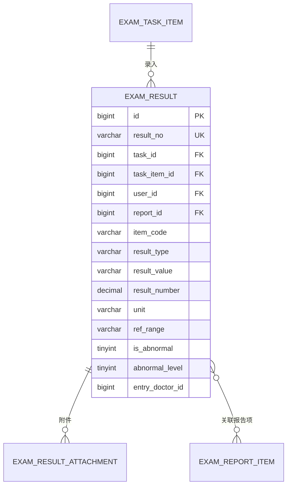
```mermaid
erDiagram
    EXAM_RESULT {
        bigint id PK
        varchar result_no UK
        bigint task_id FK
        bigint task_item_id FK
        bigint user_id FK
        bigint report_id FK
        varchar item_code
        varchar result_type
        varchar result_value
        decimal result_number
        varchar unit
        varchar ref_range
        tinyint is_abnormal
        tinyint abnormal_level
        bigint entry_doctor_id
    }

    EXAM_TASK_ITEM ||--o{ EXAM_RESULT : "录入"
    EXAM_RESULT ||--o{ EXAM_RESULT_ATTACHMENT : "附件"
    EXAM_RESULT }o--o{ EXAM_REPORT_ITEM : "关联报告项"
```

---

## 5. 报告管理

### exam_report 体检报告表
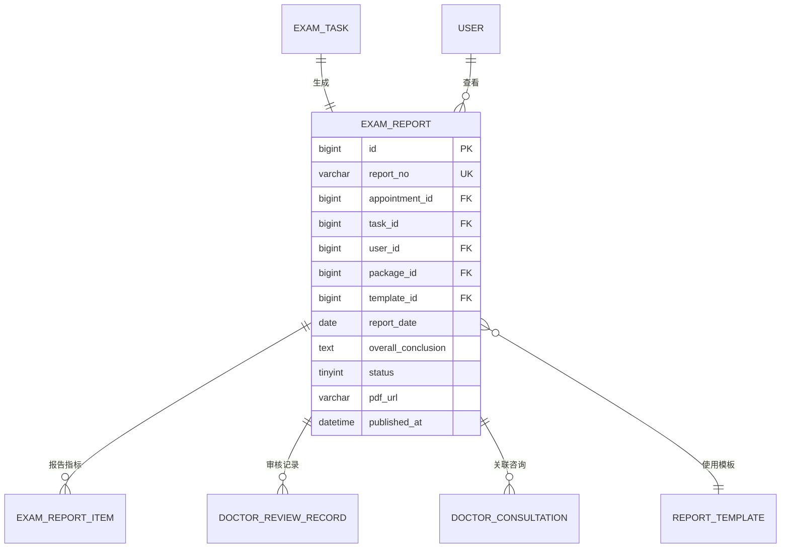
```mermaid
erDiagram
    EXAM_REPORT {
        bigint id PK
        varchar report_no UK
        bigint appointment_id FK
        bigint task_id FK
        bigint user_id FK
        bigint package_id FK
        bigint template_id FK
        date report_date
        text overall_conclusion
        tinyint status
        varchar pdf_url
        datetime published_at
    }

    EXAM_TASK ||--|| EXAM_REPORT : "生成"
    USER ||--o{ EXAM_REPORT : "查看"
    EXAM_REPORT ||--o{ EXAM_REPORT_ITEM : "报告指标"
    EXAM_REPORT ||--o{ DOCTOR_REVIEW_RECORD : "审核记录"
    EXAM_REPORT ||--o{ DOCTOR_CONSULTATION : "关联咨询"
    EXAM_REPORT }o--|| REPORT_TEMPLATE : "使用模板"
```

### exam_report_item 报告指标表
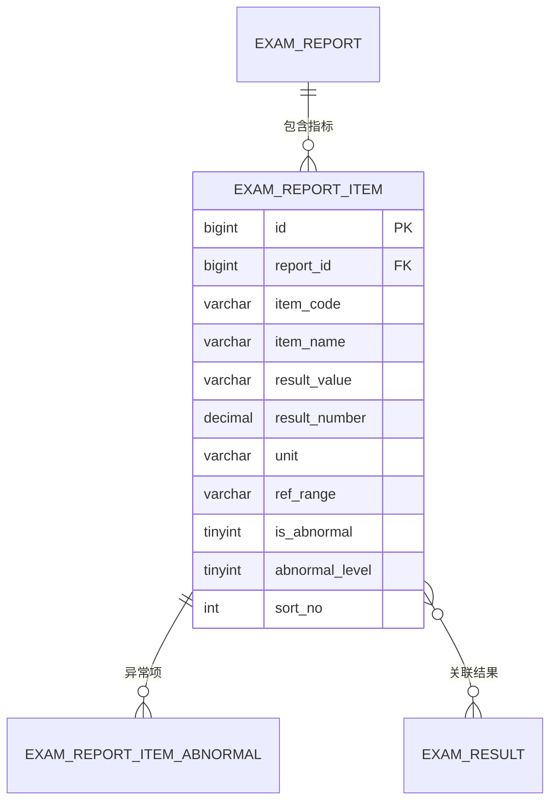
```mermaid
erDiagram
    EXAM_REPORT_ITEM {
        bigint id PK
        bigint report_id FK
        varchar item_code
        varchar item_name
        varchar result_value
        decimal result_number
        varchar unit
        varchar ref_range
        tinyint is_abnormal
        tinyint abnormal_level
        int sort_no
    }

    EXAM_REPORT ||--o{ EXAM_REPORT_ITEM : "包含指标"
    EXAM_REPORT_ITEM ||--o{ EXAM_REPORT_ITEM_ABNORMAL : "异常项"
    EXAM_REPORT_ITEM }o--o{ EXAM_RESULT : "关联结果"
```

### doctor_review_record 医生审核记录表
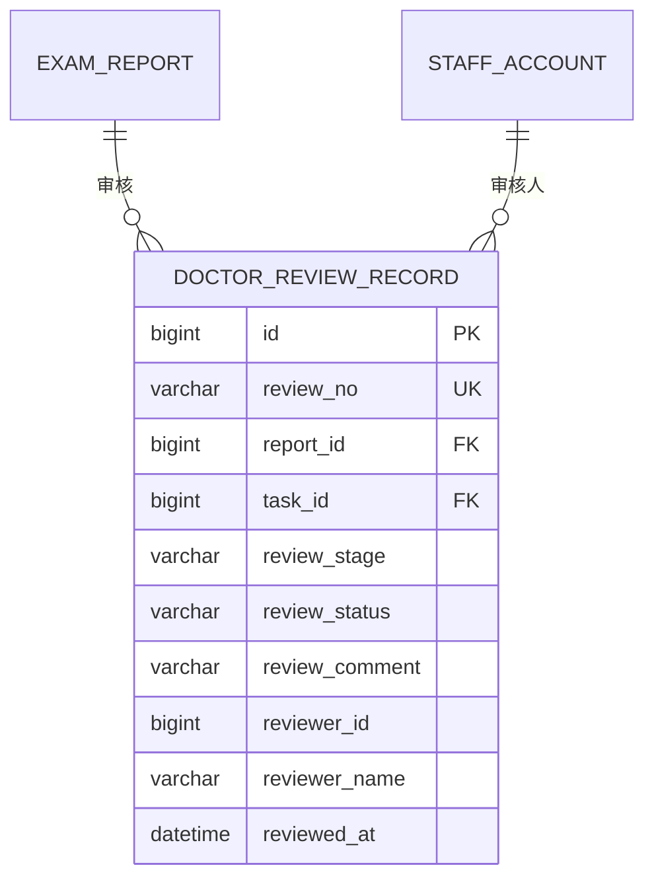
```mermaid
erDiagram
    DOCTOR_REVIEW_RECORD {
        bigint id PK
        varchar review_no UK
        bigint report_id FK
        bigint task_id FK
        varchar review_stage
        varchar review_status
        varchar review_comment
        bigint reviewer_id
        varchar reviewer_name
        datetime reviewed_at
    }

    EXAM_REPORT ||--o{ DOCTOR_REVIEW_RECORD : "审核"
    STAFF_ACCOUNT ||--o{ DOCTOR_REVIEW_RECORD : "审核人"
```

---

## 6. 咨询管理

### doctor_consultation 医生咨询主表
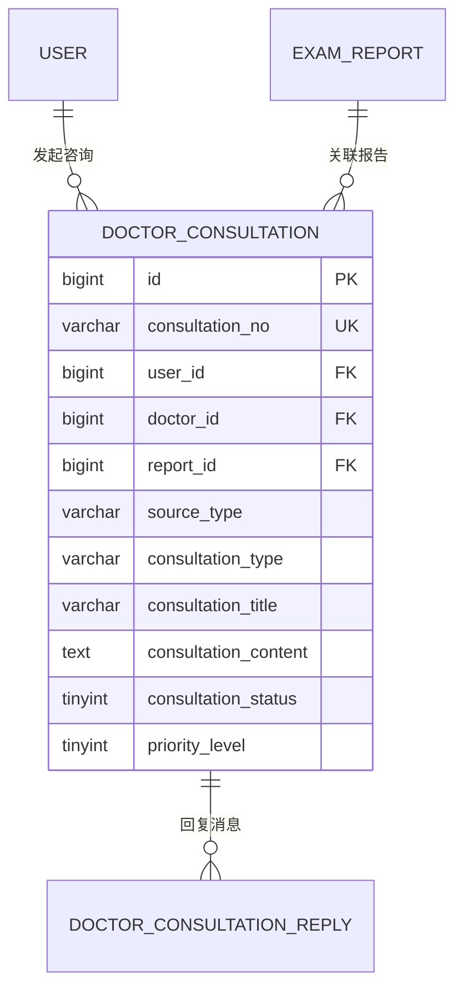
```mermaid
erDiagram
    DOCTOR_CONSULTATION {
        bigint id PK
        varchar consultation_no UK
        bigint user_id FK
        bigint doctor_id FK
        bigint report_id FK
        varchar source_type
        varchar consultation_type
        varchar consultation_title
        text consultation_content
        tinyint consultation_status
        tinyint priority_level
    }

    USER ||--o{ DOCTOR_CONSULTATION : "发起咨询"
    EXAM_REPORT ||--o{ DOCTOR_CONSULTATION : "关联报告"
    DOCTOR_CONSULTATION ||--o{ DOCTOR_CONSULTATION_REPLY : "回复消息"
```

### doctor_consultation_reply 医生咨询回复表
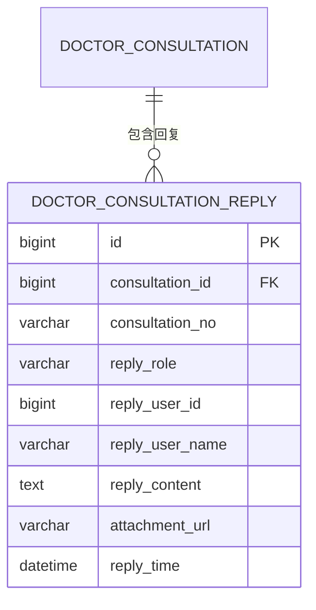
```mermaid
erDiagram
    DOCTOR_CONSULTATION_REPLY {
        bigint id PK
        bigint consultation_id FK
        varchar consultation_no
        varchar reply_role
        bigint reply_user_id
        varchar reply_user_name
        text reply_content
        varchar attachment_url
        datetime reply_time
    }

    DOCTOR_CONSULTATION ||--o{ DOCTOR_CONSULTATION_REPLY : "包含回复"
```

---

## 7. 数据分析

### report_compare_task 历年对比任务表
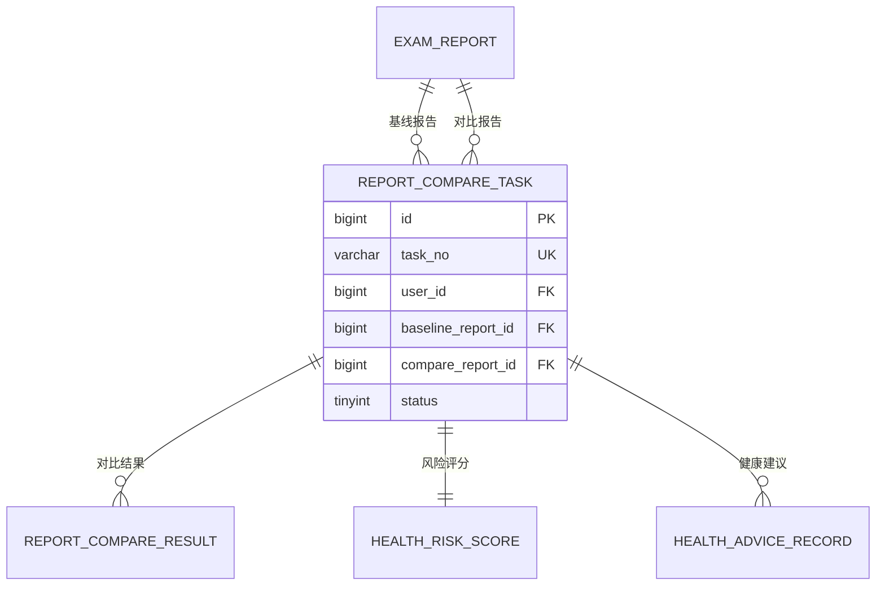
```mermaid
erDiagram
    REPORT_COMPARE_TASK {
        bigint id PK
        varchar task_no UK
        bigint user_id FK
        bigint baseline_report_id FK
        bigint compare_report_id FK
        tinyint status
    }

    EXAM_REPORT ||--o{ REPORT_COMPARE_TASK : "基线报告"
    EXAM_REPORT ||--o{ REPORT_COMPARE_TASK : "对比报告"
    REPORT_COMPARE_TASK ||--o{ REPORT_COMPARE_RESULT : "对比结果"
    REPORT_COMPARE_TASK ||--|| HEALTH_RISK_SCORE : "风险评分"
    REPORT_COMPARE_TASK ||--o{ HEALTH_ADVICE_RECORD : "健康建议"
```

### health_risk_score 健康风险评分表
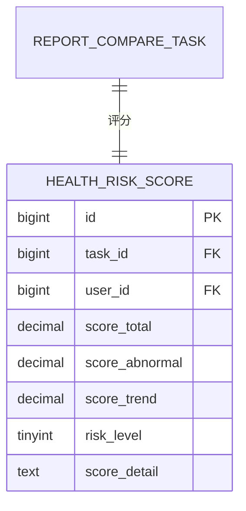
```mermaid
erDiagram
    HEALTH_RISK_SCORE {
        bigint id PK
        bigint task_id FK
        bigint user_id FK
        decimal score_total
        decimal score_abnormal
        decimal score_trend
        tinyint risk_level
        text score_detail
    }

    REPORT_COMPARE_TASK ||--|| HEALTH_RISK_SCORE : "评分"
```

---

## 8. 系统支撑

### operation_log 操作日志表
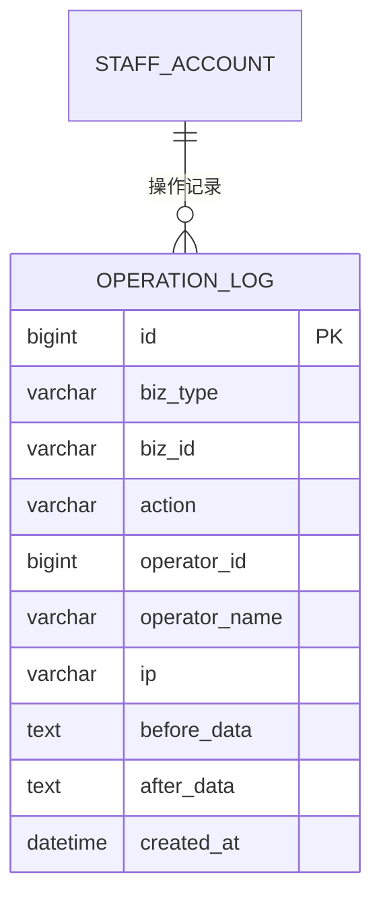
```mermaid
erDiagram
    OPERATION_LOG {
        bigint id PK
        varchar biz_type
        varchar biz_id
        varchar action
        bigint operator_id
        varchar operator_name
        varchar ip
        text before_data
        text after_data
        datetime created_at
    }

    STAFF_ACCOUNT ||--o{ OPERATION_LOG : "操作记录"
```

### data_dictionary 数据字典表
```mermaid
erDiagram
    DATA_DICTIONARY {
        bigint id PK
        varchar dict_type
        varchar dict_code
        varchar dict_name
        int sort_no
        tinyint status
    }
```

---

## 全局ER图

```mermaid
erDiagram
    USER ||--o{ APPOINTMENT : "创建预约"
    USER ||--o{ ORDER : "创建订单"
    USER ||--o{ DOCTOR_CONSULTATION : "发起咨询"
    
    STAFF_ACCOUNT ||--|| USER : "绑定"
    STAFF_ACCOUNT ||--o{ STAFF_ROLE_REL : "角色"
    STAFF_ACCOUNT ||--o{ DOCTOR_REVIEW_RECORD : "审核"
    
    EXAM_PACKAGE ||--o{ EXAM_PACKAGE_ITEM : "包含项目"
    EXAM_PACKAGE ||--o{ APPOINTMENT : "被选择"
    
    APPOINTMENT ||--|| ORDER : "生成订单"
    APPOINTMENT ||--|| EXAM_TASK : "生成任务"
    APPOINTMENT }o--|| RESOURCE_CAPACITY : "占用时段"
    
    ORDER ||--o{ ORDER_ITEM : "订单明细"
    ORDER ||--o{ PAYMENT_RECORD : "支付记录"
    
    EXAM_TASK ||--o{ EXAM_TASK_ITEM : "任务项"
    EXAM_TASK ||--|| EXAM_REPORT : "生成报告"
    
    EXAM_TASK_ITEM ||--o{ EXAM_RESULT : "录入结果"
    
    EXAM_REPORT ||--o{ EXAM_REPORT_ITEM : "报告指标"
    EXAM_REPORT ||--o{ DOCTOR_REVIEW_RECORD : "审核"
    EXAM_REPORT ||--o{ DOCTOR_CONSULTATION : "关联咨询"
    EXAM_REPORT }o--|| REPORT_TEMPLATE : "使用模板"
    
    DOCTOR_CONSULTATION ||--o{ DOCTOR_CONSULTATION_REPLY : "回复"
    
    EXAM_REPORT ||--o{ REPORT_COMPARE_TASK : "对比任务"
    REPORT_COMPARE_TASK ||--|| HEALTH_RISK_SCORE : "风险评分"
```
