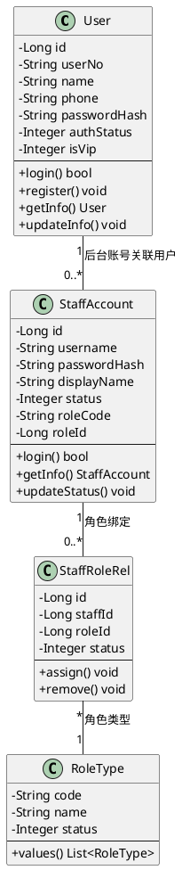
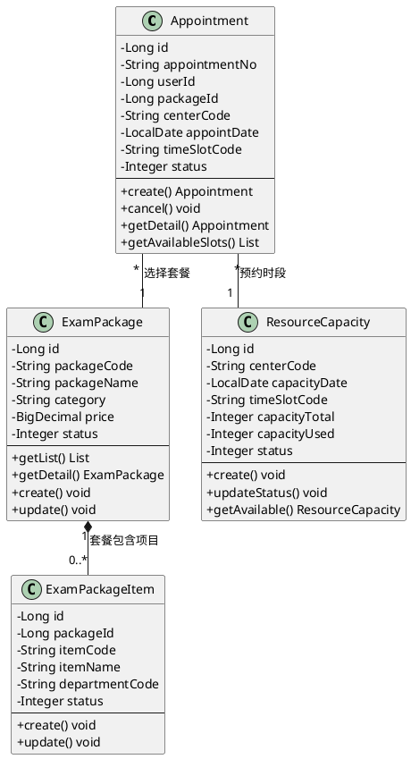
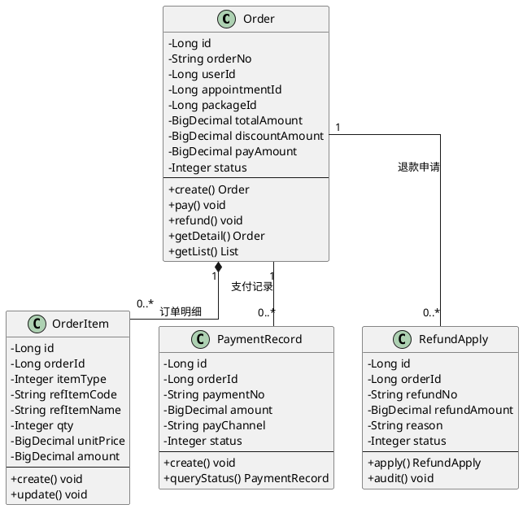
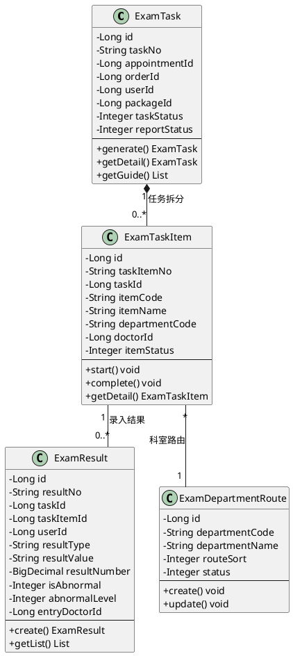
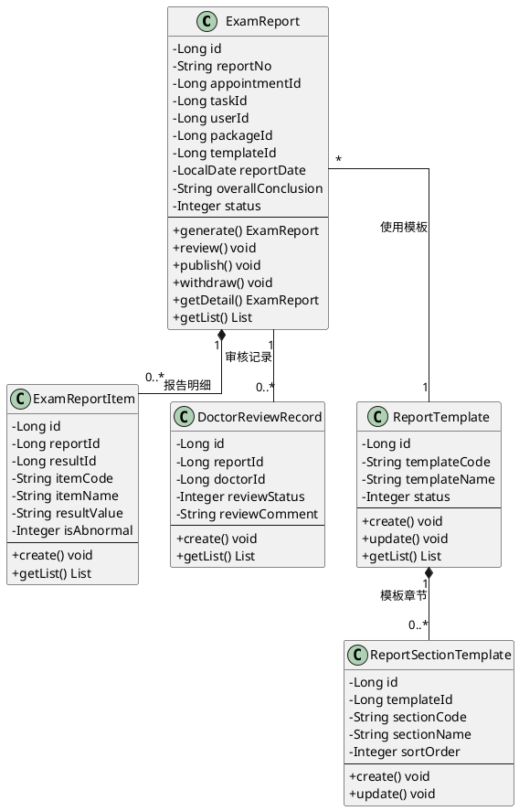
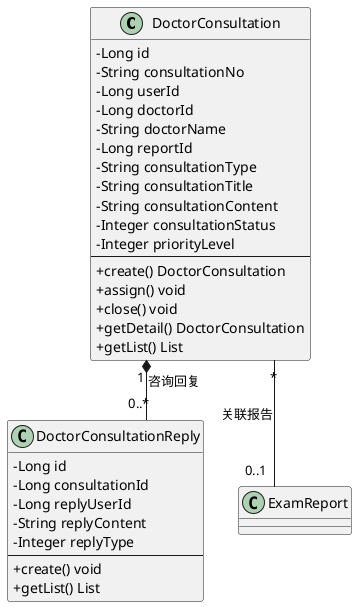
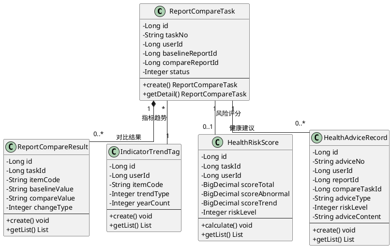
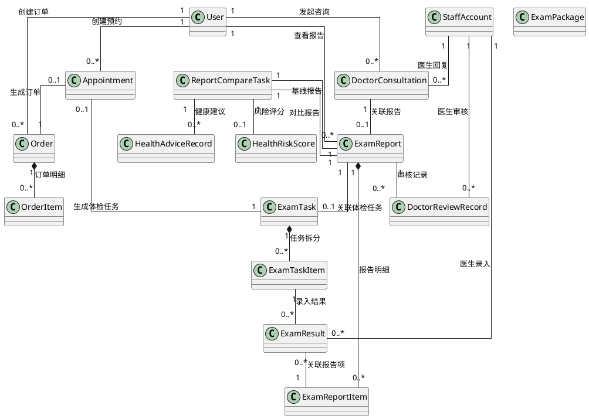

# 熙心健康体检平台 - 模块类图

## 模块划分概览

```
                    熙心健康体检平台
                         |
    +----+----+----+----+----+----+----+----+
    |    |    |    |    |    |    |    |    |
  用户  订单  预约  咨询  报告  体检  运营  体检  质控
  管理  管理  管理  管理  管理  套餐  管理  数据  管理
                        管理        分析
```

## 1. 用户管理模块 (User Management)



### 关系说明
| 关系 | 类型 | 说明 |
|------|------|------|
| User → StaffAccount | 关联 | 后台账号关联普通用户 |
| StaffAccount → StaffRoleRel | 组合 | 账号包含多个角色绑定 |
| StaffRoleRel → RoleType | 聚合 | 角色绑定关联角色类型 |

---

## 2. 预约管理模块 (Appointment Management)



### 关系说明
| 关系 | 类型 | 说明 |
|------|------|------|
| Appointment → ExamPackage | 聚合 | 预约选择体检套餐 |
| ExamPackage → ExamPackageItem | 组合 | 套餐包含多个体检项目 |
| Appointment → ResourceCapacity | 关联 | 预约占用资源时段 |

---

## 3. 订单管理模块 (Order Management)



### 关系说明
| 关系 | 类型 | 说明 |
|------|------|------|
| Order → OrderItem | 组合 | 订单包含多个订单项 |
| Order → PaymentRecord | 聚合 | 订单关联支付记录 |
| Order → RefundApply | 关联 | 订单关联退款申请 |

---

## 4. 体检执行模块 (Exam Execution)



### 关系说明
| 关系 | 类型 | 说明 |
|------|------|------|
| ExamTask → ExamTaskItem | 组合 | 体检任务拆分为多个任务项 |
| ExamTaskItem → ExamResult | 聚合 | 任务项关联体检结果 |
| ExamTaskItem → ExamDepartmentRoute | 关联 | 任务项关联科室路由 |

---

## 5. 报告管理模块 (Report Management)



### 关系说明
| 关系 | 类型 | 说明 |
|------|------|------|
| ExamReport → ExamReportItem | 组合 | 报告包含多个报告项 |
| ExamReport → DoctorReviewRecord | 聚合 | 报告关联审核记录 |
| ExamReport → ReportTemplate | 关联 | 报告使用报告模板 |
| ReportTemplate → ReportSectionTemplate | 组合 | 模板包含多个章节 |

---

## 6. 咨询管理模块 (Consultation Management)



### 关系说明
| 关系 | 类型 | 说明 |
|------|------|------|
| DoctorConsultation → DoctorConsultationReply | 组合 | 咨询包含多个回复 |
| DoctorConsultation → ExamReport | 关联 | 咨询关联体检报告 |

---

## 7. 体检数据分析模块 (Data Analysis)



### 关系说明
| 关系 | 类型 | 说明 |
|------|------|------|
| ReportCompareTask → ReportCompareResult | 组合 | 对比任务包含多个对比结果 |
| ReportCompareTask → HealthRiskScore | 关联 | 对比任务关联风险评分 |
| ReportCompareTask → HealthAdviceRecord | 聚合 | 对比任务生成健康建议 |
| ReportCompareTask → IndicatorTrendTag | 关联 | 对比任务关联指标趋势 |

---

## 8. 跨模块关系总览



---

## 模块职责总结

| 模块 | 核心职责 | 主要实体 |
|------|----------|----------|
| 用户管理 | 用户注册登录、后台账号管理、角色权限 | User, StaffAccount, StaffRoleRel |
| 预约管理 | 预约创建/取消、套餐选择、资源时段管理 | Appointment, ExamPackage, ResourceCapacity |
| 订单管理 | 订单创建/支付/退款、订单明细 | Order, OrderItem, PaymentRecord, RefundApply |
| 体检执行 | 体检任务生成、任务项执行、结果录入 | ExamTask, ExamTaskItem, ExamResult |
| 报告管理 | 报告生成/审核/发布、模板管理 | ExamReport, DoctorReviewRecord, ReportTemplate |
| 咨询管理 | 咨询创建/分配/回复、咨询记录 | DoctorConsultation, DoctorConsultationReply |
| 数据分析 | 报告对比、指标趋势、风险评分、健康建议 | ReportCompareTask, HealthRiskScore, HealthAdviceRecord |
| 运营管理 | 排班管理、资源容量、运营统计 | ResourceCapacity, StatDailyReport |
| 质控管理 | 体检质量控制、异常监控 | ExamResult, DoctorReviewRecord |
