# 熙心健康体检平台 - 模块类图（统一视图）

## 生成提示词

### Prompt 1 - 模块类图生成提示词

```
请根据以下熙心健康体检平台的模块划分和实体关系，生成一张清晰的UML类图：

【模块划分】
1. 用户管理：User, StaffAccount, StaffRoleRel
2. 预约管理：Appointment, ExamPackage, ExamPackageItem, ResourceCapacity
3. 订单管理：Order, OrderItem, PaymentRecord, RefundApply
4. 体检执行：ExamTask, ExamTaskItem, ExamResult, ExamDepartmentRoute
5. 报告管理：ExamReport, ExamReportItem, DoctorReviewRecord, ReportTemplate
6. 咨询管理：DoctorConsultation, DoctorConsultationReply
7. 数据分析：ReportCompareTask, ReportCompareResult, HealthRiskScore, HealthAdviceRecord, IndicatorTrendTag

【实体关系】
- User 1..* → StaffAccount（关联）
- StaffAccount 1..* → StaffRoleRel（组合）
- User 1..* → Appointment（创建）
- Appointment *..1 → ExamPackage（选择）
- ExamPackage 1..* → ExamPackageItem（组合）
- Appointment *..1 → ResourceCapacity（占用）
- Appointment *..1 → Order（生成）
- Order 1..* → OrderItem（组合）
- Order 1..* → PaymentRecord（聚合）
- Order 1..* → RefundApply（关联）
- Appointment *..1 → ExamTask（生成）
- ExamTask 1..* → ExamTaskItem（组合）
- ExamTaskItem 1..* → ExamResult（聚合）
- ExamTaskItem *..1 → ExamDepartmentRoute（关联）
- ExamResult *..1 → ExamReportItem（关联）
- ExamReportItem *..1 → ExamReport（组合）
- ExamReport 1..* → DoctorReviewRecord（聚合）
- ExamReport *..1 → ReportTemplate（使用）
- ReportTemplate 1..* → ReportSectionTemplate（组合）
- DoctorConsultation 1..* → DoctorConsultationReply（组合）
- DoctorConsultation *..1 → ExamReport（关联）
- ReportCompareTask 1..* → ReportCompareResult（组合）
- ReportCompareTask *..1 → ExamReport（基线/对比）
- ReportCompareTask 1..1 → HealthRiskScore（关联）
- ReportCompareTask 1..* → HealthAdviceRecord（聚合）
- StaffAccount 1..* → ExamResult（录入）
- StaffAccount 1..* → DoctorReviewRecord（审核）
- StaffAccount 1..* → DoctorConsultation（回复）

【排版要求】
- 按模块分区，用户管理在左上，预约管理在右上
- 订单管理在中上，体检执行在中间
- 报告管理在右中，咨询管理在右下
- 数据分析在左下
- 连线不要交叉，箭头清晰可见
- 每个类显示属性和方法
- 类名、属性、方法用中文注释
```

### Prompt 2 - Mermaid 生成提示词

````
请将以下UML类图转换为Mermaid格式，要求：
1. 使用classDiagram语法
2. 按模块分组，使用namespace
3. 显示类的属性和方法
4. 明确标注关系类型（组合、聚合、关联）
5. 关系箭头清晰，不重叠

模块和实体：
- 用户管理：User, StaffAccount, StaffRoleRel
- 预约管理：Appointment, ExamPackage, ExamPackageItem, ResourceCapacity
- 订单管理：Order, OrderItem, PaymentRecord, RefundApply
- 体检执行：ExamTask, ExamTaskItem, ExamResult, ExamDepartmentRoute
- 报告管理：ExamReport, ExamReportItem, DoctorReviewRecord, ReportTemplate
- 咨询管理：DoctorConsultation, DoctorConsultationReply
- 数据分析：ReportCompareTask, ReportCompareResult, HealthRiskScore, HealthAdviceRecord
````

---

## 统一类图（Mermaid格式）

```mermaid
classDiagram
    %% ========== 用户管理模块 ==========
    namespace 用户管理 {
        class User {
            -Long id
            -String userNo
            -String name
            -String phone
            -String passwordHash
            -Integer authStatus
            -Integer isVip
            +login() bool
            +register() void
            +getInfo() User
            +updateInfo() void
        }
        
        class StaffAccount {
            -Long id
            -String username
            -String passwordHash
            -String displayName
            -Integer status
            +login() bool
            +getInfo() StaffAccount
            +updateStatus() void
        }
        
        class StaffRoleRel {
            -Long id
            -Long staffId
            -Long roleId
            -Integer status
            +assign() void
            +remove() void
        }
    }

    %% ========== 预约管理模块 ==========
    namespace 预约管理 {
        class Appointment {
            -Long id
            -String appointmentNo
            -Long userId
            -Long packageId
            -String centerCode
            -LocalDate appointDate
            -String timeSlotCode
            -Integer status
            +create() Appointment
            +cancel() void
            +getDetail() Appointment
            +getAvailableSlots() List
        }
        
        class ExamPackage {
            -Long id
            -String packageCode
            -String packageName
            -String category
            -BigDecimal price
            -Integer status
            +getList() List
            +getDetail() ExamPackage
            +create() void
            +update() void
        }
        
        class ExamPackageItem {
            -Long id
            -Long packageId
            -String itemCode
            -String itemName
            -String departmentCode
            -Integer status
            +create() void
            +update() void
        }
        
        class ResourceCapacity {
            -Long id
            -String centerCode
            -LocalDate capacityDate
            -String timeSlotCode
            -Integer capacityTotal
            -Integer capacityUsed
            -Integer status
            +create() void
            +updateStatus() void
        }
    }

    %% ========== 订单管理模块 ==========
    namespace 订单管理 {
        class Order {
            -Long id
            -String orderNo
            -Long userId
            -Long appointmentId
            -Long packageId
            -BigDecimal totalAmount
            -BigDecimal discountAmount
            -BigDecimal payAmount
            -Integer status
            +create() Order
            +pay() void
            +refund() void
            +getDetail() Order
            +getList() List
        }
        
        class OrderItem {
            -Long id
            -Long orderId
            -Integer itemType
            -String refItemCode
            -String refItemName
            -Integer qty
            -BigDecimal unitPrice
            -BigDecimal amount
            +create() void
            +update() void
        }
        
        class PaymentRecord {
            -Long id
            -Long orderId
            -String paymentNo
            -BigDecimal amount
            -String payChannel
            -Integer status
            +create() void
            +queryStatus() PaymentRecord
        }
        
        class RefundApply {
            -Long id
            -Long orderId
            -String refundNo
            -BigDecimal refundAmount
            -String reason
            -Integer status
            +apply() RefundApply
            +audit() void
        }
    }

    %% ========== 体检执行模块 ==========
    namespace 体检执行 {
        class ExamTask {
            -Long id
            -String taskNo
            -Long appointmentId
            -Long orderId
            -Long userId
            -Long packageId
            -Integer taskStatus
            -Integer reportStatus
            +generate() ExamTask
            +getDetail() ExamTask
            +getGuide() List
        }
        
        class ExamTaskItem {
            -Long id
            -String taskItemNo
            -Long taskId
            -String itemCode
            -String itemName
            -String departmentCode
            -Long doctorId
            -Integer itemStatus
            +start() void
            +complete() void
            +getDetail() ExamTaskItem
        }
        
        class ExamResult {
            -Long id
            -String resultNo
            -Long taskId
            -Long taskItemId
            -Long userId
            -String resultType
            -String resultValue
            -BigDecimal resultNumber
            -Integer isAbnormal
            -Integer abnormalLevel
            -Long entryDoctorId
            +create() ExamResult
            +getList() List
        }
        
        class ExamDepartmentRoute {
            -Long id
            -String departmentCode
            -String departmentName
            -Integer routeSort
            -Integer status
            +create() void
            +update() void
        }
    }

    %% ========== 报告管理模块 ==========
    namespace 报告管理 {
        class ExamReport {
            -Long id
            -String reportNo
            -Long appointmentId
            -Long taskId
            -Long userId
            -Long packageId
            -Long templateId
            -LocalDate reportDate
            -String overallConclusion
            -Integer status
            +generate() ExamReport
            +review() void
            +publish() void
            +withdraw() void
            +getDetail() ExamReport
            +getList() List
        }
        
        class ExamReportItem {
            -Long id
            -Long reportId
            -Long resultId
            -String itemCode
            -String itemName
            -String resultValue
            -Integer isAbnormal
            +create() void
            +getList() List
        }
        
        class DoctorReviewRecord {
            -Long id
            -Long reportId
            -Long doctorId
            -Integer reviewStatus
            -String reviewComment
            +create() void
            +getList() List
        }
        
        class ReportTemplate {
            -Long id
            -String templateCode
            -String templateName
            -Integer status
            +create() void
            +update() void
            +getList() List
        }
    }

    %% ========== 咨询管理模块 ==========
    namespace 咨询管理 {
        class DoctorConsultation {
            -Long id
            -String consultationNo
            -Long userId
            -Long doctorId
            -String doctorName
            -Long reportId
            -String consultationType
            -String consultationTitle
            -String consultationContent
            -Integer consultationStatus
            -Integer priorityLevel
            +create() DoctorConsultation
            +assign() void
            +close() void
            +getDetail() DoctorConsultation
            +getList() List
        }
        
        class DoctorConsultationReply {
            -Long id
            -Long consultationId
            -Long replyUserId
            -String replyContent
            -Integer replyType
            +create() void
            +getList() List
        }
    }

    %% ========== 数据分析模块 ==========
    namespace 数据分析 {
        class ReportCompareTask {
            -Long id
            -String taskNo
            -Long userId
            -Long baselineReportId
            -Long compareReportId
            -Integer status
            +create() ReportCompareTask
            +getDetail() ReportCompareTask
        }
        
        class ReportCompareResult {
            -Long id
            -Long taskId
            -String itemCode
            -String baselineValue
            -String compareValue
            -Integer changeType
            +create() void
            +getList() List
        }
        
        class HealthRiskScore {
            -Long id
            -Long taskId
            -Long userId
            -BigDecimal scoreTotal
            -BigDecimal scoreAbnormal
            -BigDecimal scoreTrend
            -Integer riskLevel
            +calculate() void
            +getList() List
        }
        
        class HealthAdviceRecord {
            -Long id
            -String adviceNo
            -Long userId
            -Long reportId
            -Long compareTaskId
            -String adviceType
            -Integer riskLevel
            -String adviceContent
            +create() void
            +getList() List
        }
    }

    %% ========== 跨模块关系 ==========
    
    %% 用户管理
    User "1" -- "0..*" StaffAccount : 关联
    StaffAccount "1" *-- "0..*" StaffRoleRel : 组合
    
    %% 用户 → 预约
    User "1" -- "0..*" Appointment : 创建
    User "1" -- "0..1" StaffAccount : 关联
    
    %% 预约管理
    Appointment "*" -- "1" ExamPackage : 选择
    ExamPackage "1" *-- "0..*" ExamPackageItem : 组合
    Appointment "*" -- "1" ResourceCapacity : 占用
    
    %% 预约 → 订单
    Appointment "0..1" -- "1" Order : 生成
    
    %% 订单管理
    Order "1" *-- "0..*" OrderItem : 组合
    Order "1" -- "0..*" PaymentRecord : 聚合
    Order "1" -- "0..*" RefundApply : 关联
    
    %% 预约 → 体检
    Appointment "0..1" -- "1" ExamTask : 生成
    
    %% 体检执行
    ExamTask "1" *-- "0..*" ExamTaskItem : 组合
    ExamTaskItem "1" -- "0..*" ExamResult : 聚合
    ExamTaskItem "*" -- "1" ExamDepartmentRoute : 关联
    
    %% 体检 → 报告
    ExamResult "*" -- "1" ExamReportItem : 关联
    ExamReportItem "*" -- "1" ExamReport : 组合
    ExamTask "0..1" -- "1" ExamReport : 关联
    
    %% 报告管理
    ExamReport "1" *-- "0..*" ExamReportItem : 组合
    ExamReport "1" -- "0..*" DoctorReviewRecord : 聚合
    ExamReport "*" -- "1" ReportTemplate : 使用
    
    %% 报告 → 咨询
    DoctorConsultation "*" -- "0..1" ExamReport : 关联
    DoctorConsultation "1" *-- "0..*" DoctorConsultationReply : 组合
    
    %% 报告 → 数据分析
    ReportCompareTask "*" -- "1" ExamReport : 基线
    ReportCompareTask "*" -- "1" ExamReport : 对比
    ReportCompareTask "1" *-- "0..*" ReportCompareResult : 组合
    ReportCompareTask "1" -- "0..1" HealthRiskScore : 关联
    ReportCompareTask "1" -- "0..*" HealthAdviceRecord : 聚合
    
    %% StaffAccount 关联
    StaffAccount "1" -- "0..*" ExamResult : 录入
    StaffAccount "1" -- "0..*" DoctorReviewRecord : 审核
    StaffAccount "1" -- "0..*" DoctorConsultation : 回复
```



---

## 关系类型说明

| 关系类型 | UML符号 | Mermaid语法 | 说明 |
|----------|---------|-------------|------|
| 组合 | ◆ | `*--` | 强关联，部分不能独立于整体存在 |
| 聚合 | ◇ | `o--` | 弱关联，部分可以独立于整体存在 |
| 关联 | → | `--` | 结构性关系，持有引用 |
| 依赖 | ╌> | `..>` | 使用关系，临时引用 |
| 实现 | ╌|> | `..|>` | 接口实现 |
| 继承 | △ | `<|--` | 继承关系 |

---

## 模块关系矩阵

```
用户管理 ──创建──→ 预约管理 ──生成──→ 订单管理
   │                  │                  │
   │                  │                  │
   ↓                  ↓                  ↓
预约管理 ──生成──→ 体检执行 ←──── 订单管理
                      │
                      │ 录入结果
                      ↓
报告管理 ←──── 体检执行
   │
   │ 关联报告
   ↓
咨询管理 ──基于──→ 报告管理
   │
   │ 数据分析
   ↓
数据分析 ←──── 报告管理
```

---

## 核心业务流程

1. **预约流程**: User → Appointment → ExamPackage → ResourceCapacity
2. **订单流程**: Appointment → Order → OrderItem → PaymentRecord
3. **体检流程**: Appointment → ExamTask → ExamTaskItem → ExamResult
4. **报告流程**: ExamResult → ExamReportItem → ExamReport → DoctorReviewRecord
5. **咨询流程**: ExamReport → DoctorConsultation → DoctorConsultationReply
6. **分析流程**: ExamReport → ReportCompareTask → HealthRiskScore → HealthAdviceRecord
